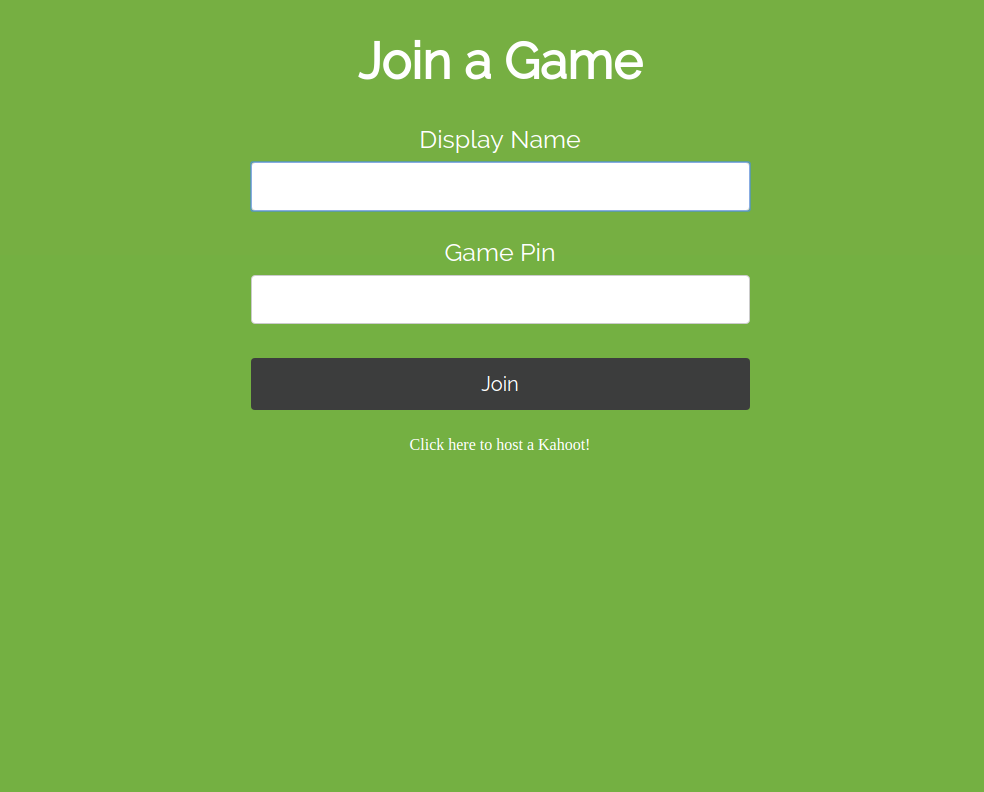

# KAHOOT QUIZ SERVER

## Introduction

This project is forked from [kahoot-clone-nodejs](https://github.com/ethanbrimhall/kahoot-clone-nodejs) in Github, and it is similar to that version but with the below modifications.

1. A Chinese font named "NotoSansCJK"(思源黑体). It is compressed from the original version from google fonts. [Here](https://github.com/notofonts/noto-cjk) is a link to its Github page. We compressed it using a script shell `./font_compress/compress.sh` inspired by [MoyuScript](https://gist.github.com/MoyuScript/f94d0c594e47113b209156a653aaba93). 
2. Rewrite the `.css` files in the `frontend/public/css/` folder. We delete some redundant codes.
3. Add more features as introduced in [here](#features).

## [Description](https://github.com/ethanbrimhall/kahoot-clone-nodejs#description)

This project is a kahoot clone that uses nodejs and mongodb.

Multiple games can be ongoing at one time and works with many players per game.

## How to Use It

### Start the game server

To run it for the first time, you need to clone this repo into your server, `cd` into the repo folder, and run `./build.sh`. This will allow you to build a new docker image named `kahoot-frontend:latest` and run it. Another docker container named `mongodb` will be also started.

### Start a new quiz

When the two docker containers start running, you can access the kahoot game from the port `3000`. You will see a interface like below.



A host is need to host the game. When you click `Click here to host a new quiz game!` and choose a game, you will see a interface like below.


The game pin is used for players to join the game room. After all players join, the host can start the game by click the button at the bottom of the page. 

When the game start, the host will show the page include questions and four answers, like below.


All the players will see the below interface with four answers, and they can choose one answer by click it.


After all the players submit their answer or time is up, the host will show a page include the correct answer and the result of submissions.


Every player will be told whether their submission is correct or not.


## Export or import the database

For lazy people, use mongodump, it's faster:
``` shell
mongodump -d kahootDB -o dbbackup --forceTableScan
```

And to "restore/import" it (from directory_backup/dump/):
``` shell
mongorestore -d kahootDB dbbackup/kahootDB
```

(learn more from [here](https://stackoverflow.com/questions/11255630/how-to-export-all-collections-in-mongodb))

## Features

- When game is alive, players can reflush their page to reconnect to the game.
- Players can rejoin to the game from the home using their username and the game pin when game is alive.
- Each question can have different time to answer. The score is computed by `100 + \<answer time> / \<total time> * 100` if the answer is correct else 0.
- Only allow unique username in each game.

## Special Thanks

- [ethanbrimhall](https://github.com/ethanbrimhall) for the creative idea.
- Google fonts for the beautiful font "NotoSansCJK".
- MoyuScript for the font compressing script.
